# Car Dealership Inventory System

A full-stack car dealership inventory management application built as a take-home assessment.

## Live Demo

- **Frontend**: [https://main.d10m6lw7wr9ko5.amplifyapp.com](https://main.d10m6lw7wr9ko5.amplifyapp.com)
- **Backend API**: [https://car-dealership-inventory-system-gjrt.onrender.com](https://car-dealership-inventory-system-gjrt.onrender.com)

> **Note on Performance**: The backend is hosted on Render's free tier. If the server has been inactive, it may take **1-2 minutes** for the initial request to wake it up. Please be patient when first loading or interacting with the application!

## Repository Structure

This is a monorepo containing both the backend and frontend components.

```
car-dealership-inventory-system/
├── backend/     # Express.js REST API
├── frontend/    # React SPA (Vite + Tailwind)
└── README.md    # Top-level documentation
```

- **[Backend Documentation](./backend/README.md)**
- **[Frontend Documentation](./frontend/README.md)**

## Running the Application Locally

You will need two terminal windows to run the full stack application.

1. **Start the Backend**

   ```bash
   cd backend
   npm install
   npm start
   ```

   _(Backend runs on http://localhost:3000)_

2. **Start the Frontend**
   ```bash
   cd frontend
   npm install
   npm run dev
   ```
   _(Frontend runs on http://localhost:5173 and proxies API calls to the backend)_

## My AI Usage

**AI Tool Used**: Google Gemini, Claude (via an integrated Agentic AI coding assistant)

**How it was used**:

- **Boilerplate & Scaffolding**: I used the AI to generate the initial Vite React frontend and Express backend boilerplate.
- **Test-Driven Development (TDD)**: The AI was prompted to strictly follow a Red-Green-Refactor cycle. It wrote the failing tests first using Vitest and Jest, and then implemented the business logic in the backend controllers/services and frontend components to make them pass.
- **UI & Aesthetics**: I asked the AI to ensure the application used a beautiful, responsive, modern design. Initially styled as a glossy, rounded UI, it was later completely refactored into a custom "Dealer Spec Sheet" aesthetic. This included stark layouts, monospace technical typography (Bebas Neue & IBM Plex Mono), a scroll-locked sidebar architecture, and a togglable Dark/Light mode using CSS variables.
- **Documentation**: The AI generated this README file, the `PROMPTS.md` chat log, and a detailed walkthrough of the final implementation.

**Reflection**:
Using an agentic AI coding assistant significantly accelerated the development process. Instead of manually writing boilerplate CRUD logic and basic component layouts, I was able to act as the architect and product manager, directing the AI through the strict requirements of the Kata. The AI handled the context switching between backend and frontend seamlessly. The strict TDD requirement helped keep the AI's implementations focused and bug-free, preventing it from hallucinating logic that wasn't covered by tests.

## Test Report

The project maintains high test coverage across both the backend and frontend.

### Backend Tests

```
Test Suites: 7 passed, 7 total
Tests:       32 passed, 32 total
Coverage:    95%+ Lines
```

### Frontend Tests

```
Test Suites: 6 passed, 6 total
Tests:       24 passed, 24 total
```

### Screenshots

- Home Page

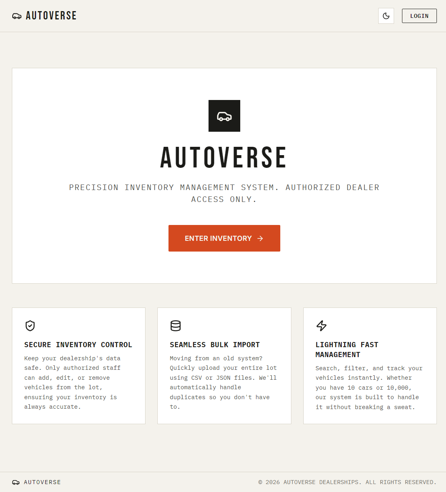

- Home Page (Dark Mode)

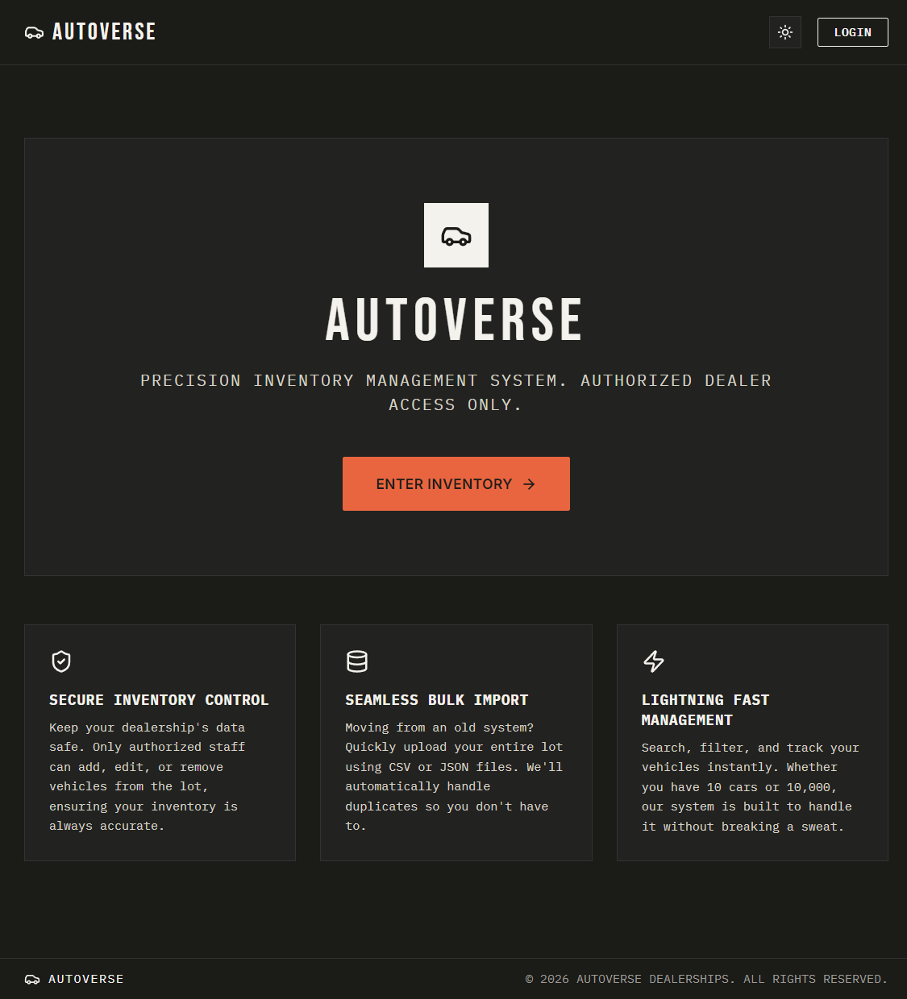

- Login

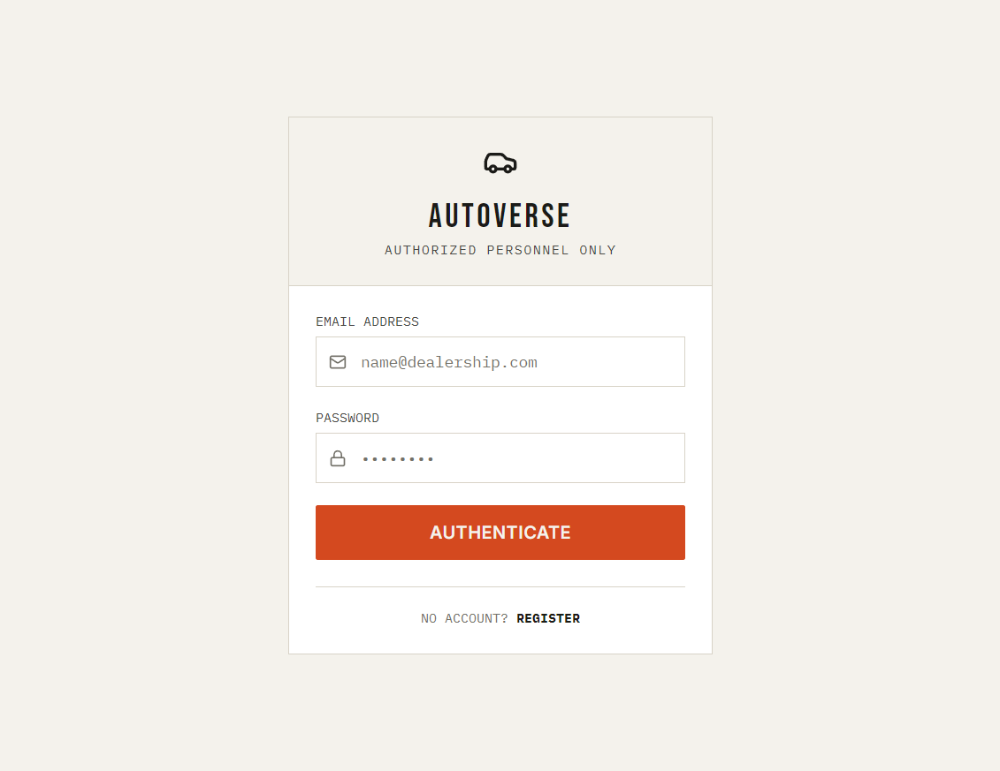

- Register

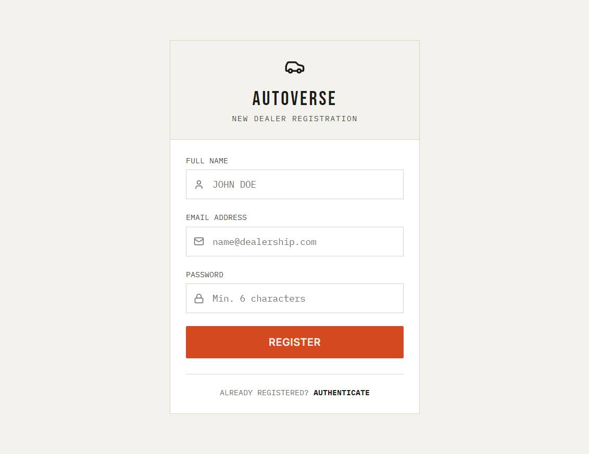

- Admin Dashboard

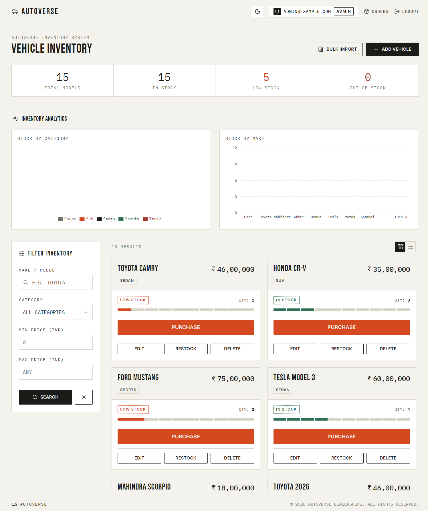

- User Dashboard

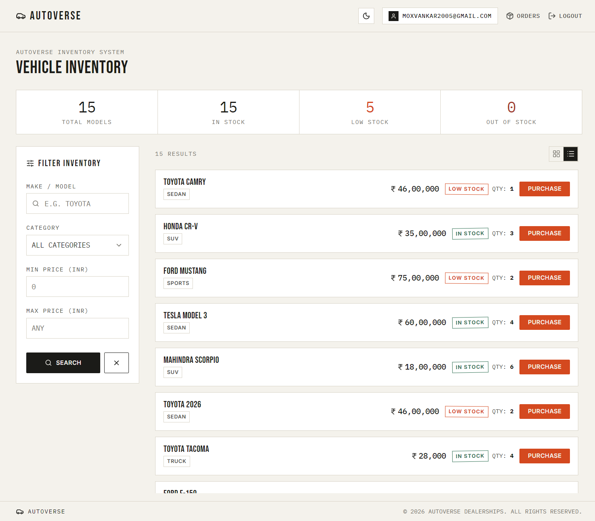

- Graphs and Charts

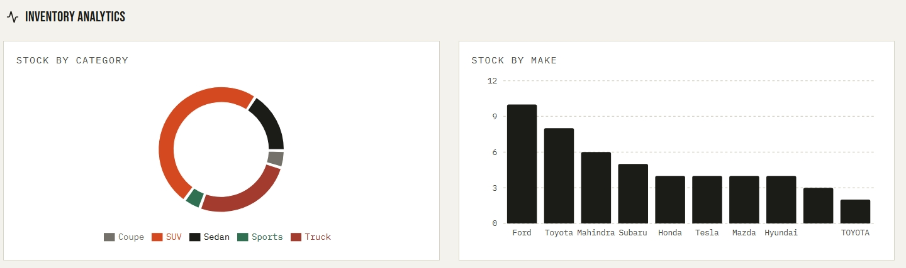

- Orders

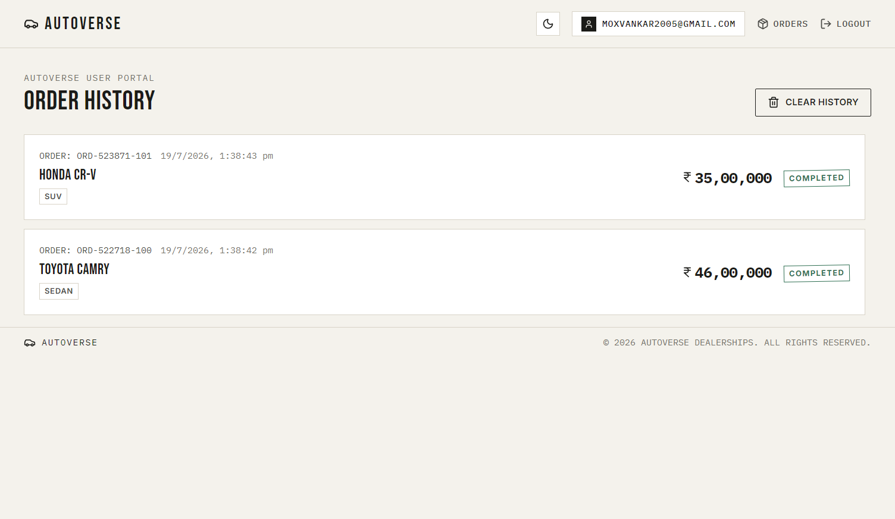

- Add Vehicle

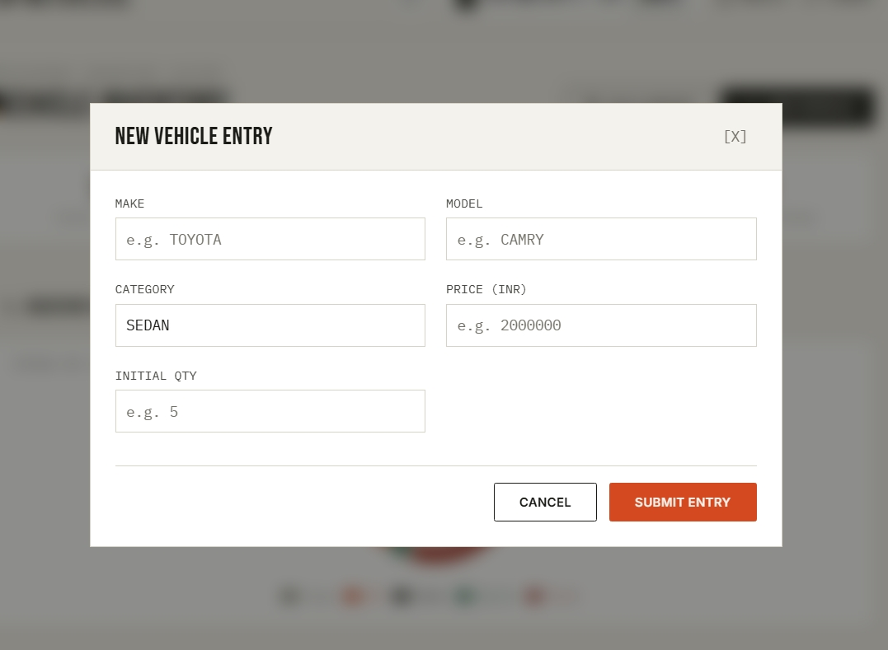

- Restock Modal

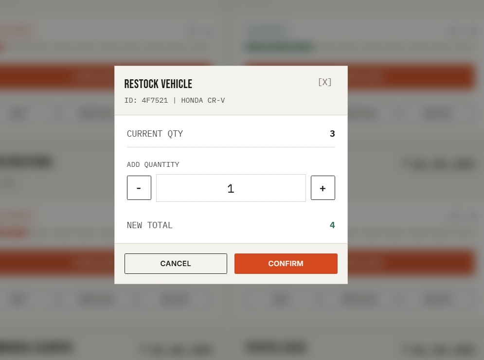

- Additional Screenshot

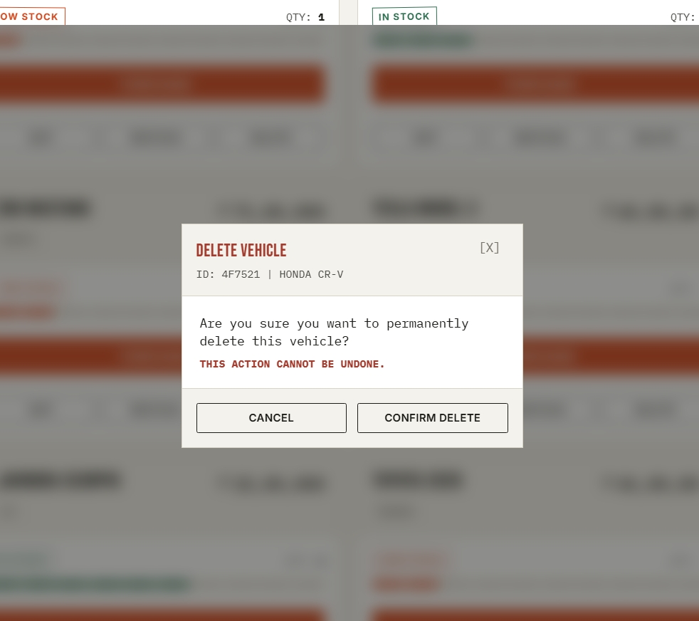
